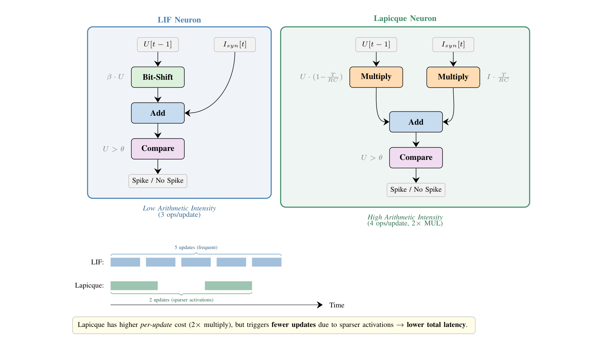
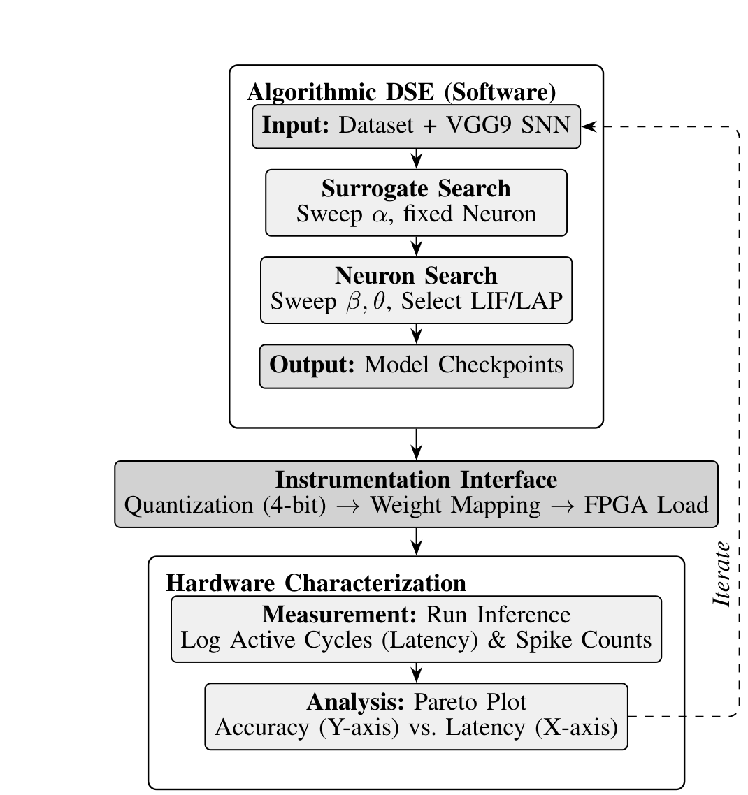
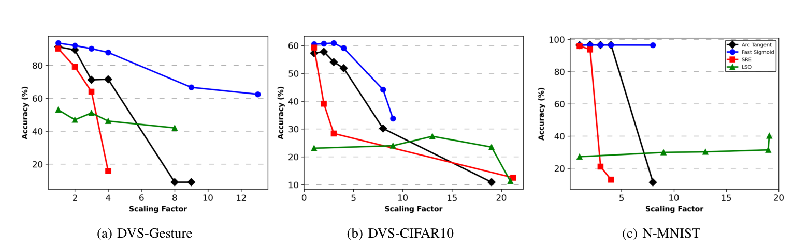
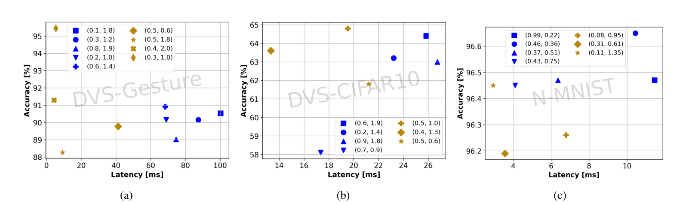

# Surrogates, Spikes, and Sparsity

**Performance Analysis and Characterization of SNN Hyperparameters on Hardware**

This repository contains the implementation and reproducibility artifacts for our ISPASS 2026 paper. We present a systematic workload characterization study quantifying the sensitivity of hardware inference latency to SNN training-time hyperparameters — specifically surrogate gradient functions and neuron models — across event-based vision datasets.

> **Note:** If you use this work, please [cite our paper](#citation).

## Key Contributions

- **Surrogate gradient characterization**: Evaluation of Fast Sigmoid, Arctangent, Spike Rate Estimator, and Stochastic Spike Operator — quantifying trade-offs between accuracy and hardware activation sparsity.
- **Neuron model analysis**: LIF vs. Lapicque neuron models, demonstrating up to 28% latency reduction through improved sparsity dynamics.
- **Workload-specific profiling**: Analysis across DVS128-Gesture, N-MNIST, and DVS-CIFAR10.
- **Hardware-in-the-loop validation**: Cycle-accurate FPGA instrumentation platform for latency and spike count measurement.

## LIF vs. Lapicque Neuron Dataflow

<p align="center">
  
</p>

LIF relies on lightweight bit-shifts for decay (low arithmetic intensity), while Lapicque requires explicit multiplication to model RC constants. Despite higher per-operation cost, Lapicque's superior temporal dynamics suppress total spike events, leading to a net reduction in system-level latency.

## Methodology

<p align="center">
  
</p>

Our two-phase DSE strategy first sweeps surrogate gradient functions and slope parameters for accuracy, then explores neuron model configurations (LIF/Lapicque) with varying decay and threshold settings. Top candidates are profiled on the FPGA instrumentation platform for cycle-accurate latency measurement.

## Key Results

### Accuracy Sensitivity to Surrogate Gradients

<p align="center">
  
</p>

Fast Sigmoid maintains peak accuracy across the widest range of slopes. SRE and ATAN exhibit cliff-like degradation — their exponential tails aggressively suppress spiking activity, risking vanishing gradients if the slope is not carefully bounded.

### Pareto Analysis: Neuron Model vs. Latency

<p align="center">
  
</p>

Lapicque (yellow) consistently clusters in the high-accuracy, low-latency quadrant across all three datasets. On N-MNIST, Lapicque provides a 28% latency reduction at comparable accuracy. The increased arithmetic cost of the RC-circuit model is fully amortized by the reduction in total spike events.

---

## Repository Structure

```
Scripts/           Python training, extraction, and utility scripts
Hardware/
  ispass_sim/      ISPASS FPGA instrumentation platform (SystemVerilog)
  hybrid_sim/      DATE25 hybrid simulation hardware
  hybrid_synth/    DATE25 hybrid synthesis hardware (FP32)
  hybrid_synth_int/DATE25 hybrid synthesis hardware (INT4)
  sparse_sim/      DATE25 sparse simulation hardware
  sparse_synth_int/DATE25 sparse synthesis hardware (INT4)
docs/figures/      Paper figures
```

## Requirements

- **Python 3.11**
- **PyTorch 2.2.2 with CUDA 12.1**
- **snnTorch 0.7.0**
- **Brevitas 0.10.2**
- **tonic** (for DVS event-based datasets)

Install dependencies:
```bash
pip install -r Scripts/requirements.txt
```

## Scripts Overview

| Script | Purpose |
|---|---|
| `Training.py` | Main training script |
| `Extract.py` | Extracts weights/biases for hardware simulation |
| `Net.py` | VGG9 SNN model with configurable surrogate and neuron type |
| `Configs.py` | Hyperparameters: surrogate type, neuron model, beta, threshold, slope |
| `Datasets.py` | Dataset classes for DVS-Gesture, N-MNIST, DVS-CIFAR10, CIFAR10, etc. |
| `Functions.py` | Training/test loops, weight extraction, macro file generation |

## Configuration

All hyperparameters are set in `Configs.py`:

```python
config = {
    "beta": 0.15,             # Membrane decay rate
    "threshold": 0.5,         # Firing threshold
    "slope": 1.0,             # Surrogate gradient scaling factor (alpha)
    "surrogate_type": "fast_sigmoid",  # "fast_sigmoid", "atan", "spike_rate_escape", "SSO"
    "neuron_type": "lif",     # "lif" or "lapicque"
    ...
}
```

### Surrogate Gradient Functions

| Name | Config Value | snnTorch Function |
|---|---|---|
| Fast Sigmoid (FS) | `"fast_sigmoid"` | `surrogate.fast_sigmoid(slope)` |
| Arctangent (ATAN) | `"atan"` | `surrogate.atan(alpha)` |
| Spike Rate Estimator (SRE) | `"spike_rate_escape"` | `surrogate.spike_rate_escape(beta)` |
| Stochastic Spike Operator (SSO) | `"SSO"` | `surrogate.SSO(mean, variance)` |

### Neuron Models

| Model | Config Value | Description |
|---|---|---|
| Leaky Integrate-and-Fire | `"lif"` | Standard LIF with bit-shift decay |
| Lapicque | `"lapicque"` | RC-circuit model with explicit multiply for decay |

## Datasets

Set the dataset in `Training.py` (or `Extract.py`):

```python
dataset = DVSGesture(config, data_path)   # 11 classes, 2ch, event-based
dataset = NMNIST(config, data_path)       # 10 classes, 2ch, event-based
dataset = DVSCIFAR10(config, data_path)   # 10 classes, 2ch, event-based
dataset = CIFAR10(config, data_path)      # 10 classes, 3ch, static
```

DVS datasets use the **tonic** library and produce event-to-frame conversions with configurable time bins.

## Network Architecture

VGG9 SNN adapted for event-based inputs:

```
64C3 - 28C3 - MP2 - 48C3 - 54C3 - MP2 - 120C3 - 126C3 - 140C3 - MP2 - FC1064 - FC(pop_size)
```

Input channels (2 for DVS, 3 for RGB) and spatial dimensions are automatically set from the dataset class.

## Training

```bash
cd Scripts
python Training.py
```

Modify `Training.py` to select your dataset. The script trains both FP32 and INT4 quantized models, saving the best checkpoint per trial.

## Weight Extraction for Hardware Simulation

1. Set `model_name`, `model_path`, and `dataset` in `Extract.py`
2. Configure EC sizes for each layer
3. Run:
```bash
python Extract.py
```

The script outputs extracted weights to `Extracted_Models/` and generates a `macros.txt` file containing all hardware parameters including `neuron_type`, `beta`, `threshold`, and `conv_1_1_input_frame_width`.

Copy the printed `` `include `` line into the hardware `top_wrapper.sv`.

## Hardware Simulation (ISPASS Platform)

The ISPASS instrumentation platform is in `Hardware/ispass_sim/`. It supports:
- Configurable neuron type (LIF / Lapicque) via `NEURON_TYPE` parameter
- Configurable `beta` and `threshold` from macros
- Variable input frame width for different DVS resolutions
- Cycle-accurate latency measurement with spike counting

### Running in Vivado

1. Copy the `` `define `` line from `Extract.py` output into `top_wrapper.sv`
2. Add `-d SIM` to `xsim.compile.xvlog.more_options` in simulation settings
3. Run behavioral simulation
4. Simulation completes when `fc_2_spk_RAM_loaded` triggers
5. Results written to `cycles_and_spikes.txt`

## Citation

If you find this work useful, please cite:

```bibtex
@inproceedings{aliyev2026surrogates,
  title={Surrogates, Spikes, and Sparsity: Performance Analysis and Characterization of SNN Hyperparameters on Hardware},
  author={Aliyev, Ilkin and Lopez, Jesus and Adegbija, Tosiron},
  booktitle={IEEE International Symposium on Performance Analysis of Systems and Software (ISPASS)},
  year={2026}
}
```

## License

MIT License. See [LICENSE](LICENSE) for details.
